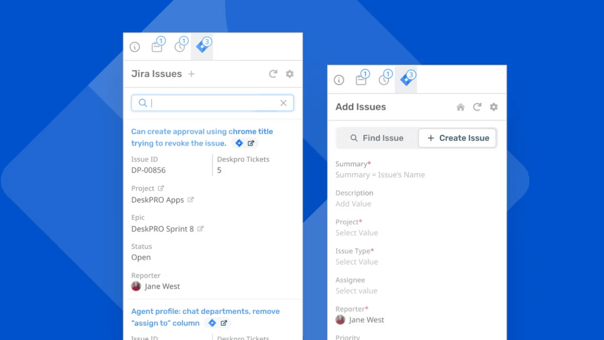

<div align='center'>
  <a target='_blank' href=''></a>
  <a target='_blank' href='https://github.com/deskproapps/jira-data-center/issues'></a>
  <a target='_blank' href='https://github.com/deskproapps/jira-data-center/blob/master/LICENSE.md'></a>
  <a target='_blank' href='https://github.com/deskproapps/jira-data-center/releases'></a>
  <a target='_blank' href='https://www.linkedin.com/company/deskpro'></a>
  
</div>

<div align='center'>
  <h1>Jira Data Center App</h1>
  <p>Our Jira Data Center integration (for a self-managed/self-hosted version of Jira) enables your support agents and engineers to work closely together and track issues with ease.</p>
  <a href='https://support.deskpro.com/ga/guides/developers/anatomy-of-an-app' target='_blank'>Deskpro Apps Documentation</a>
  <span>&nbsp;&nbsp;•&nbsp;&nbsp;</span>
  <a href='https://developer.atlassian.com/cloud/jira-data-center/platform/rest' target='_blank'>Jira Data Center API Documentation</a>
  <span>&nbsp;&nbsp;•&nbsp;&nbsp;</span>
  <a href='./SETUP.md' target='_blank'>Jira Data Center App Setup Guide</a>
  <br />
  <hr />
  <br />
</div>



## **About the App**
The Jira Data Center app brings powerful Jira issue tracking capabilities directly into Deskpro for organizations using self-managed or self-hosted Jira Data Center instances. Support agents and engineers can collaborate seamlessly by viewing, creating, and linking Jira issues to Deskpro tickets—all from within the helpdesk interface. Access up-to-date issue statuses, project information, and relevant details in real time. This integration streamlines support workflows, enhances visibility for agents, and fosters efficient communication between support and engineering teams using Jira Data Center.

## **Setting up the app in Deskpro**
You can follow our [setup guide](./SETUP.md) for a step-by-step guide to setting up the Jira Data Center app in Deskpro.

## Development

### With DevContainers (Recommended)
To make development easier and avoid version conflicts, we recommend using **DevContainers** for local development. This approach ensures that everyone on the team uses the same environment, reducing setup issues and version mismatches between dependencies.

#### Why use DevContainers?
- **Consistency:** All developers work in the same environment, with the same versions of dependencies, tools, and configurations.
- **Speed:** The DevContainer setup is quick to start, letting you focus on coding rather than environment setup.
- **Isolation:** Avoid conflicts between different versions of Node.js, PNPM, or other dependencies by using the predefined container setup.

#### Getting Started with DevContainers
1. Ensure that you have [Docker](https://www.docker.com/get-started) and [VS Code](https://code.visualstudio.com/) installed.
2. Open the project in [VS Code](https://code.visualstudio.com/).
3. If you have the **Remote - Containers** extension installed, [VS Code](https://code.visualstudio.com/) should automatically detect the `.devcontainer` configuration in this project and prompt you to reopen the folder in the container.
4. After opening the project in the DevContainer, run:
   ```bash
   pnpm start
   ```

You should now be able to view the app in your browser. For more information about developing [Deskpro Apps](https://www.deskpro.com/apps), [visit the docs](https://support.deskpro.com/ga/guides/developers/anatomy-of-an-app).

### Natively
_We recommend using the DevContainer mentioned above for Consistency, Speed and Isolation._

This app was developed primarily using **TypeScript**, **React**, and **Vite**.

#### Setup
To run this project locally:

 ```bash
# Clone the repository
git clone https://github.com/DeskproApps/jira-data-center.git

# Change to the project directory
cd jira-data-center

# Install dependencies
pnpm install

# Run the development server
pnpm start
```

You should now be able to view the app in your browser. For more information about developing [Deskpro Apps](https://www.deskpro.com/apps), [visit the Docs](https://support.deskpro.com/ga/guides/developers/anatomy-of-an-app).

### Testing
We've included `jest` to run tests. It will look anywhere in `/src` for test suite files ending in `.test.tsx` or `.test.ts`.

You can run all tests using:

```bash
pnpm test
```

## Versioning
Every app deployment requires that the version property in the `manifest.json` file be updated to reflect the new app version. This is so Deskpro can detect changes and add/upgrade apps accordingly. As such, we've made altering versions easy by having CI make the actual version change for you. Here's what we do:

* We increment **patch** versions, i.e. 1.0.1, automatically. This is the default
* **Minor** versions, i.e. 1.1.0, are incremented if you add the `minor-version` GitHub label to your PR
* **Major** versions, i.e. 2.0.0, are incremented if you add the `major-version` GitHub label to your PR

## Top Contributors
[](https://github.com/deskproapps/jira-data-center/graphs/contributors)


## License
Distributed under the MIT License. See [LICENSE.md](LICENSE.md) for more information.