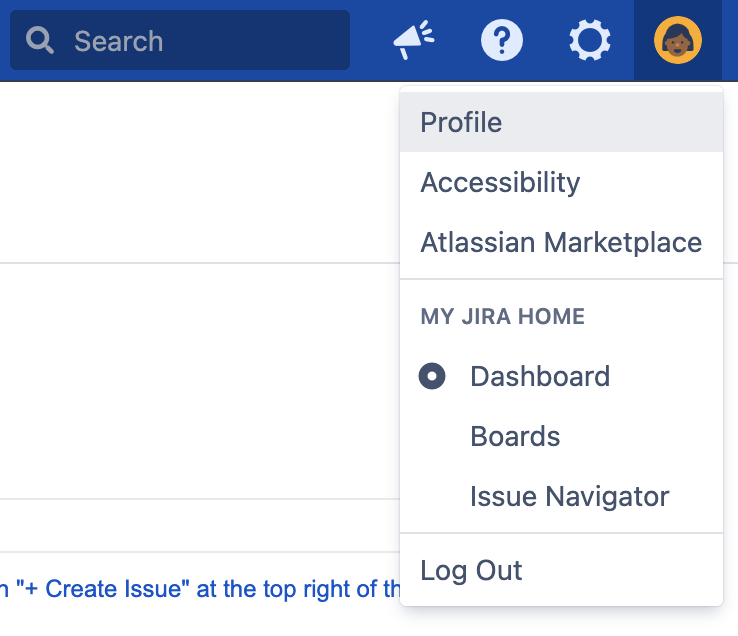

JIRA App Setup
===

To install the JIRA Data Center app you must first create an API key. Head over your JIRA Data Center cloud account, the URL will look something
like `https://<my_company>.atlassian.net/` or your own instance.

Once you've logged in, navigate to the "Account Settings" section.

Next, go to the "Security" page. Here you'll find the "API Token" section.

Click on the link labelled "Create and manage API tokens"

In the "API Tokens" section, click the "Create API token" button.

Enter a label for the new API key (this can be anything you like). In the following example we've
labelled it "Deskpro JIRA Data Center App"

After creating the API token, reveal it by clicking the "eye" icon. Copy the API key for a later step. It's **important that you keep your secret API token safe**.

Ok, now head back to Deskpro and navigate to the "Settings" tab of the JIRA app.

From this screen, enter the following details:

* **Instance URL** - this is your JIRA Data Center URL, e.g. if your JIRA Data Center URL is `https://my_company.atlassian.net`
* **API Key** - this is the key you created in the previous steps
* **Email/Username** - Your JIRA user's email address or username

To configure who can see and use the JIRA app, head to the "Permissions" tab and select those users and/or groups you'd like to have access.

When you're happy, click "Install".
